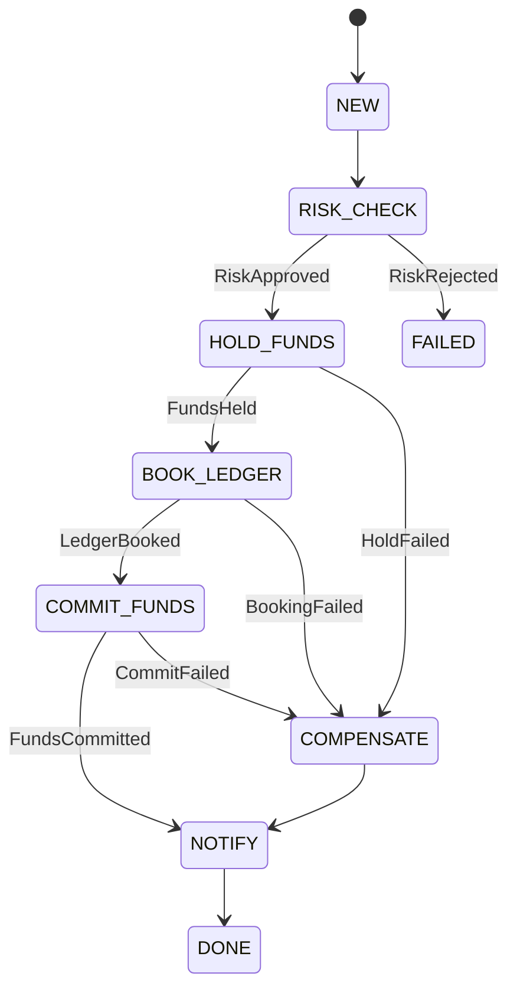

# saga-laboratory

분산 트랜잭션 환경에서 **SAGA 패턴**(오케스트레이션/코레오그래피)을 학습하고 검증하기 위한 실험용 프로젝트입니다.  
금융 도메인(계좌 이체, 원장 기록, 리스크 심사, 알림)을 예시로 구현하며, **오케스트레이션 기반**을 우선적으로 다룹니다.

---

## 🎯 프로젝트 목표

- 마이크로서비스 환경에서 **분산 트랜잭션 정합성**을 보장하는 구조 학습
- 오케스트레이션 기반 Saga State Machine 구현
- 이벤트 기반 아키텍처(Kafka/RabbitMQ)와 Outbox 패턴 적용
- 실패/보상 시나리오 및 타임아웃/재시도 정책 검증
- Redis, PostgreSQL 기반 멱등 처리 및 상태 관리

---

## 📂 모듈 구조

saga-laboratory/
├── common/                 # DTO, 이벤트, 에러, 공통 유틸 (OutboxRecord, idempotency)
├── orchestrator/           # Saga Orchestrator (상태 머신, 타임아웃/재시도, 보상 처리)
├── account-service/        # 계좌/잔액 관리 (잔액 hold/commit, 차감/가산)
├── ledger-service/         # 이중부기 원장 (Debit/Credit 분개, reversal 지원)
├── risk-service/           # AML/이상거래 심사 (동기/비동기)
├── notification-service/   # 알림 서비스 (성공/실패 결과 발행)
└── docker-compose.yml      # Kafka/RabbitMQ, PostgreSQL, Redis 로컬 실행


---

## ⚙️ 기술 스택

- **Language**: Java 21
- **Framework**: Spring Boot 3.x
- **Messaging**: Kafka (또는 RabbitMQ)
- **Database**: PostgreSQL (서비스별 DB), Redis (멱등성, 락)
- **Infra**: Docker Compose (개발/테스트 환경)
- **Testing**: JUnit 5, Testcontainers

---

## 🔄 기본 유스케이스: 송금 (Transfer)

1. **사용자 요청** → Orchestrator `POST /sagas/transfer`
2. **리스크 심사** → `RiskApproved` or `RiskRejected`
3. **계좌 hold** → 잔액 예약
4. **원장 기록** → 이중부기 분개 (Debit/Credit)
5. **계좌 commit** → 예약분 확정 차감
6. **알림 발송** → 성공/실패 결과 이벤트 발행
7. **Orchestrator 상태 전이** → 최종 `DONE` 또는 `FAILED`

---

## 🛠 실행 방법

### 1. 인프라 실행
```bash
docker-compose up -d
````

* Kafka (또는 RabbitMQ)
* PostgreSQL (각 서비스 DB)
* Redis

### 2. 서비스 빌드 및 실행

```bash
./gradlew clean build
./gradlew :orchestrator:bootRun
./gradlew :account-service:bootRun
./gradlew :ledger-service:bootRun
./gradlew :risk-service:bootRun
./gradlew :notification-service:bootRun
```

---

## 📊 상태 다이어그램



---

## 🧩 주요 패턴

* **Transactional Outbox**: DB 트랜잭션 + Outbox 테이블 → 별도 퍼블리셔가 이벤트 발행
* **Idempotency**: `request_id` 기반 중복 방지 테이블
* **Retry/Timeout**: Orchestrator 상태별 watchdog
* **Compensation**: 실패 시 보상 워크플로 (reverse ledger, release hold)
* **Observability**: `request_id` 기반 로그 상관관계 추적, 메트릭/트레이싱

---

## 🚀 향후 계획

* 코레오그래피 기반 Saga 실험
* Debezium CDC Outbox 전환
* OpenTelemetry 기반 분산 트레이싱
* 멱등 키 만료 정책 도입
* 샤딩/파티션 전략 검증

---

## 📜 라이선스

```